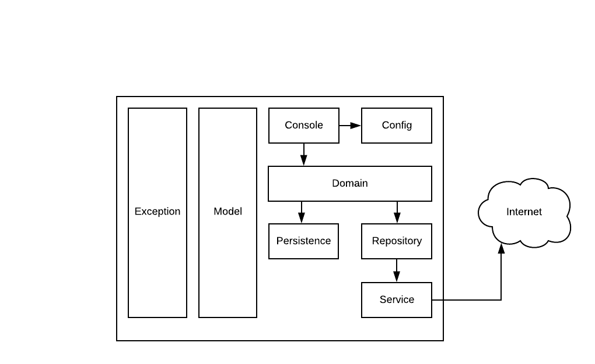

# App-for-unit-testing

Aplicación de consola creada con el fin de practicar pruebas unitarias, es decir, 
debes crearle sus pruebas unitarias. 

### Tecnologías de desarrollo 
La aplicación fue construída con las siguientes herramientas y lenguajes:
* Spring Boot
* Spring Shell
* Retrofit 2
* Okhttp 3
* Gradle
* Java 8

### Empaquetado:
EL proyecto se empaqueta en un .jar Para ello, se debe ejecutar el comando:
                 
    gradle bootJar

Ese comando generará el jar con el nombre de acuerdo a la siguiente configuración ubicada en el archivo build.gradle

    bootJar {
        baseName('unit-testing-app')
        version('1.0.0')
    }

Para la consiguración anterior el jar generado tendra el nombre unit-testing-app-1.0.0.jar La versión debe ser actualizada según los cambios realizados,
ya sean mayores o menores.

### Ejecución:
Para ejecutar unit-testing-app en consola interactiva a traves del Jar generado, se debe ejecutar el siguiente comando. A partir de ahí se puede interactuar con la consola 
y cualquier comando disponible:

    java -jar unit-testing-app-[version].jar
    
Para ejecutar **unit-testing-app** desde el **IDE** solo se debe ejecutar la clase **App** ubicada en el paquete **com.cedaniel200.practice.**

Para ejecutar los test se debe ejecutar la tarea test de gradle por medio del IDE o por medio de la consola del sistema usando el comando:

    gradle test

### Comandos de la aplicación 
La aplicación cuenta con los siguientes comandos o funcionalidades:
    
**Calculator Commands**

    add [--first-number] int  [--second-number] int
    
    divide [--dividend] int  [--divider] int
    
    multiply [--first-number] int  [--second-number] int
    
    subtract [--first-number] int  [--second-number] int

**Email Commands**
    
    send [--to] string  [--subject] string  [--message] string

**Greeting Commands** (--language soportados: es, en o pt)

    greet [--language] string

**User Commands** (Consumen los servicios en https://reqres.in)

    find-by-id [--id] int
    
    list
    
    
    
Para mayor informacion de cada comando ejecute desde la consola:

    help nombre_comando
    
Ejemplo: **help add**, lo que nos mostraría la siguiente información:

    NAME
            add - Add two whole numbers
    
    SYNOPSYS
            add [--first-number] int  [--second-number] int
    
    OPTIONS
            --first-number  int
    
                    [Mandatory]
    
            --second-number  int
    
                    [Mandatory]

Para comandos adicionales ejecute desde consola el comando 'help' para obtener información acerca de las instrucciones disponibles.

### Cobertura
La cobertura de unit-testing-app está configurada con Jacoco, se excluyen los paquetes de clases de model, config,
console y la clase main (App).
Para correr la medición de cobertura se debe ejecutar el siguiente comando:

    gradle clean test jacocoTestReport

El reporte se encuentra en build/jacoco/test/hatml/index.html

Otra forma de hacerlo es a traves de las tareas de gradle por medio del IDE
estas se deben ejecutar en el mismo orden (Clean, test, jacocoTestReport).

### Diagrama de Arquitectura

    + exception
        Capa trasverla donde se encuentran las lases que controlan las posibles excepciones
        técnicas y de negocios que se presentan durante la ejecución de la aplicación
    + model
        Capa trasverla donde se encuentran las clases relacionadas con el modelo de dominio
    + console
        Capa donde se encuentran las clases que representan cada uno de los comandos permititdos
        es el punto de entrada para cada operación o fución que se quiera realizar
    + domain
        Capa donde se encuentran las clases con la lógica y/o reglas de negocio
    + persistence
        Capa donde se encuentran las clases que implementan el patrón DAO y/o
        aquellas que acceden a datos
    + repository
        Capa donde se encuentran las clases que implementan el patrón Repository, puede 
        a su vez tener comunicación con la capa de persistence, ya que, el patrón DAO y 
        Persistence no son excluyentes
    + service
        Capa donde se encuentran las clases que representan clientes HTTP para comunicación con 
        servicios en la nube
        
## Si tiene alguna pregunta, puede escribirme a cdanielmg200@gmail.com  