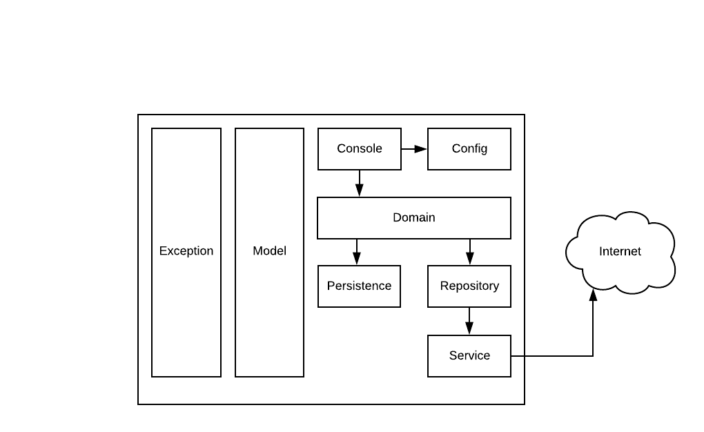

# App-for-unit-testing


[](LICENSE)

Aplicación de consola creada para practicar **pruebas unitarias**. El repositorio contiene el código fuente funcional pero los tests están incompletos — tu tarea es escribir las pruebas unitarias de cada clase de dominio.

## Table of Contents

- [What you'll practice](#what-youll-practice)
- [Tech Stack](#tech-stack)
- [Getting Started](#getting-started)
- [Project Structure](#project-structure)
- [Usage](#usage)
- [Testing](#testing)
- [Configuration](#configuration)
- [Architecture](#architecture)

## What you'll practice

- **JUnit 4** — escribir pruebas unitarias con asserts, excepciones esperadas y assertions personalizadas
- **Mockito 2** — aislar la capa de dominio mockeando dependencias con `@Mock` e `@InjectMocks`
- **JUnitParams** — pruebas parametrizadas para cubrir múltiples casos con un solo método
- **PowerMock** — mockear constructores y métodos estáticos en casos excepcionales (con moderación)
- **JaCoCo** — medir cobertura del código y buscar líneas no cubiertas

## Tech Stack

| Technology | Version |
|------------|---------|
| Java | 17 |
| Spring Boot | 3.5.14 |
| Spring Shell | 3.4.2 |
| Gradle | 9.5.1 |
| Retrofit 2 + Gson | 2.x |
| JUnit 4 | 4.12 |
| Mockito | 2.19.0 |
| PowerMock | 2.0.0 |
| JaCoCo | 0.8.15 |

## Getting Started

### Prerequisites

- Java 17+
- Gradle 9.5.1 (wrapper incluido)

### Build

```bash
./gradlew bootJar
```

Genera el jar en `build/libs/unit-testing-app-1.0.0.jar`.

### Run

```bash
java -jar build/libs/unit-testing-app-1.0.0.jar
```

O ejecuta la clase `App` desde el IDE (paquete `com.cedaniel200.practice`).

> [!WARNING]
> El comando `send` requiere las variables de entorno `EMAIL_USERNAME` y `EMAIL_PASSWORD` configuradas. Sin ellas, el envío fallará con un mensaje de error. Consulta [Configuration](#configuration) para más detalles.

### IDE

- **IntelliJ IDEA**: `File → Open` y selecciona el archivo `build.gradle` — se abrirá como proyecto Gradle automáticamente
- **VS Code**: abre la carpeta raíz con las extensiones Gradle y Java instaladas

## Project Structure

```
src/main/java/com/cedaniel200/practice/
├── console/      # Comandos de consola (Spring Shell)
├── domain/       # Lógica de negocio — capa más interna, Java puro
│   ├── calculator/     # Calculadora (Strategy Pattern)
│   │   └── operation/  # Adder, Subtractor, Multiplier, Divider
│   ├── email/          # Envío de correos
│   ├── greeting/       # Saludos por idioma
│   ├── phrase/         # Frases
│   └── user/           # Usuarios (integración HTTP)
├── persistence/  # Acceso a datos (DAO)
├── repository/   # Abstracción de repositorios
└── service/      # Clientes HTTP (Retrofit a JSONPlaceholder)
```

## Usage

La aplicación expone comandos interactivos via Spring Shell.

### Calculator

| Command | Description |
|---------|-------------|
| `add --first-number <int> --second-number <int>` | Suma dos números enteros |
| `subtract --first-number <int> --second-number <int>` | Resta dos números enteros |
| `multiply --first-number <int> --second-number <int>` | Multiplica dos números enteros |
| `divide --dividend <int> --divider <int>` | Divide dos números enteros |

### Email

| Command | Description |
|---------|-------------|
| `send --to <string> --subject <string> --message <string>` | Envía un correo electrónico |

### Greeting

| Command | Description |
|---------|-------------|
| `greet --language <es\|en\|pt>` | Saludo en el idioma especificado |

### User (consumen API https://jsonplaceholder.typicode.com)

| Command | Description |
|---------|-------------|
| `find-by-id --id <int>` | Busca un usuario por ID |
| `list` | Lista todos los usuarios |

> [!TIP]
> Para más detalles de cada comando ejecuta `help <nombre>` desde la consola. Por ejemplo: `help add`.

## Testing

### Para estudiantes

```bash
./gradlew unitTest
```

Ejecuta solo las pruebas unitarias (archivos `*Test.java`). Es el único comando necesario para el aprendizaje.

Para generar reporte de cobertura:

```bash
./gradlew unitTest jacocoUnitTestReport
```

El reporte se abre en `build/reports/jacoco/jacocoUnitTestReport/html/index.html`.

El stub inicial es `CalculatorDefaultTest.java`. Escribe los tests para cada clase de dominio:

| Domain class | What to test |
|--------------|--------------|
| `AdderDefault` | Suma de enteros |
| `SubtractorDefault` | Resta de enteros |
| `MultiplierDefault` | Multiplicación de enteros |
| `DividerDefault` | División exacta, división por cero lanza `ArithmeticException` |
| `CalculatorDefault` | Cada operación delega correctamente en su strategy |
| `GreetingByLanguage` | `es` → "Hola", `en` → "Hello", `pt` → "Ola", otro → "unsupported language" |
| `GreetingDomainDefault` | Delegación a `GreetingByLanguage` |
| `EmailDomainDefault` | Comportamiento con `EmailHandler` mockeado |
| `EmailHandlerDefault` | Envío exitoso/fallido, contadores de enviados y no enviados |
| `PhraseDomainDefault` | Autor vacío → "anonymous", creación y obtención de frases |
| `UserDomainDefault` | ID válido (1-10), ID fuera de rango, `MalformedDataException`, `ServiceNotAvailableException` |

> [!NOTE]
> La cobertura con JaCoCo excluye los paquetes `config/`, `console/`, `model/` y la clase `App`, ya que el objetivo es medir solo la capa de dominio.

### Para mantenimiento de la app

| Command | Description |
|---------|-------------|
| `./gradlew e2eTest` | Pruebas end-to-end de consola (`*E2E*.java`) |
| `./gradlew integrationTest` | Pruebas de integración con servicios externos (`*Integration*.java`) |
| `./gradlew test` | Todas las pruebas |
| `./gradlew clean test jacocoTestReport` | Todas + reporte de cobertura global |

> [!WARNING]
> Las pruebas E2E e Integration consumen conexiones HTTP externas y no son necesarias para el aprendizaje de pruebas unitarias.

## Configuration

### Variables de entorno

| Variable | Description |
|----------|-------------|
| `EMAIL_USERNAME` | Correo Gmail para enviar |
| `EMAIL_PASSWORD` | App password de Gmail |

```bash
export EMAIL_USERNAME=micorreo@gmail.com
export EMAIL_PASSWORD=abcd1234efgh5678
```

Si no se configuran, el comando `send` usará valores por defecto y fallará con un mensaje de error.

## Architecture



- **`console/`**: Comandos de consola (Spring Shell). Punto de entrada para cada operación.
- **`domain/`**: Lógica y reglas de negocio. Capa más interna, sin dependencias de frameworks.
- **`persistence/`**: Implementación del patrón DAO para acceso a datos.
- **`repository/`**: Implementación del patrón Repository. Puede comunicarse con la capa de persistencia.
- **`service/`**: Clientes HTTP para comunicación con servicios en la nube (Retrofit).
- **`exception/`**: Capa transversal con excepciones técnicas y de negocio (`MalformedDataException`, `ServiceNotAvailableException`).
- **`model/`**: Capa transversal con clases del modelo de dominio.

### Design Patterns

- **Strategy**: `CalculatorDefault` compone `Adder`, `Subtractor`, `Multiplier`, `Divider`.
- **Interface + Impl Default**: Separación interfaz/implementación en cada subdominio.
- **Repository**: `UserRepository` + `UserRepositoryDefault`.
- **DAO**: `PhraseDao`.
- **DI por constructor**: Via Spring (`@Configuration` en `config/`).

## License

[MIT](LICENSE) © Cesar Daniel
